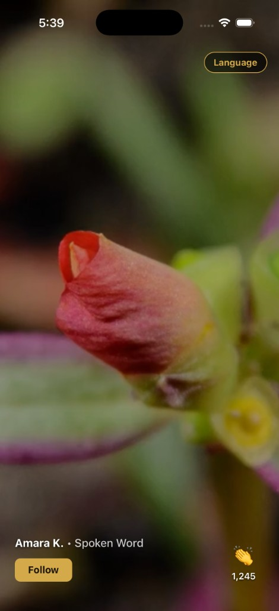

# Developer Hub — Stage Feed

React Native CLI app (not Expo) for **Task 1**: a vertical, full-screen performance feed.

The app opens on **Home** — a TikTok-style snap feed of 10 mock performances. Each item fills the viewport with looping video, creator overlay, Follow / Following, Applaud with a clap burst, and a Battle countdown chip on three items.

Branch: `Test_TasK_1`

---

## Preview

First performance in the feed (dark theme). Full-bleed looping video with a dim overlay, creator line, gold Follow button, and applaud control.



| | |
| --- | --- |
| Feed | 10 mock performances from local JSON |
| Video | Remote MP4 via `react-native-video`, cover fit, loop |
| Interactions | Follow toggle, Applaud + clap burst animation |
| Battle chips | 3 items — upcoming countdown (gold) or **Battle Live** (red) |

Light / dark appearance is available in **Settings** (Language button → top right on Home).

---

## What the app does

### Feed

- Vertical **snap paging** — one performance per screen, swipe up/down.
- Only the **active** item plays video with sound. Neighbors stay paused and muted.
- Shimmer placeholder until the first frame is ready; a short buffering indicator on rebuffer.
- Video players attach with a staggered delay so the first clip loads fast and off-screen rows do not all decode at once.

### Overlay

- Creator name and talent category, e.g. `Amara K. • Spoken Word`.
- **Follow** / **Following** toggle (session state, not persisted).
- **Applaud** — count increments, button scales, clap emoji bursts fly toward center.

### Battle chip

Three performances include a battle start time (computed from offsets at launch):

| Creator | Category | Chip behaviour |
| --- | --- | --- |
| Sofia P. | Jazz Vocals | `Battle in 1h 24m` — ticks down every second |
| Elena V. | Piano | `Battle Live` — offset is already in the past |
| Luca B. | Acoustic Guitar | `Battle in 2h 15m` — ticks down every second |

When a countdown reaches zero, the same chip flips to **Battle Live** without remounting.

### Out of scope

Live streaming pipeline, backend API, persisted follow/applause, and the Battle ceremony itself.

---

## Stack

| | |
| --- | --- |
| Runtime | React Native **0.87**, React **19**, TypeScript |
| Video | **react-native-video** 6 — MP4, loop, buffer config |
| Animation | React Native **Animated** API (`useNativeDriver`) for clap burst + applaud scale |
| Navigation | React Navigation native stack (Home → Settings) |
| State | Zustand (theme, language, shared clock) |
| i18n | i18next + react-native-localize (25 locales) |
| Persistence | react-native-keychain for language + appearance |

---

## Prerequisites

1. **Node.js 22.11.0+** — React Native 0.87 officially supports `^22.13`, `^24.3`, or `>=26`. Node 25 works with **npm** (warnings only); **yarn** may refuse to install.
2. **Watchman** on macOS if Metro file watching is flaky.
3. Official RN environment: https://reactnative.dev/docs/set-up-your-environment
4. **iOS:** Xcode, CocoaPods, Simulator.
5. **Android:** Android Studio, JDK, emulator (or USB device with debugging), SDK licenses accepted.

Confirm:

```sh
node -v
npm -v
```

---

## Setup

### 1. Clone and branch

```sh
git clone https://github.com/MuneebQureshi1/DeveloperHubTestTask.git
cd DeveloperHubTestTask
git checkout Test_TasK_1
```

Already cloned:

```sh
git fetch origin
git checkout Test_TasK_1
```

### 2. Install JavaScript packages

Use **npm**, not yarn (see Troubleshooting):

```sh
npm ci
```

First time or after dependency changes:

```sh
npm install
```

### 3. iOS pods (iOS only)

First clone, and again after native deps change (`react-native-video`, `react-native-localize`, `react-native-keychain`):

```sh
bundle install
bundle exec pod install --project-directory=ios
```

Or:

```sh
cd ios && pod install && cd ..
```

Skip for Android-only.

### 4. Metro

```sh
npm start
```

Stale cache or after dependency fixes:

```sh
npm start -- --reset-cache
```

### 5. iOS

```sh
npm run ios
```

First Xcode build can take several minutes. Specific simulator:

```sh
npx react-native run-ios --simulator="iPhone 16"
```

### 6. Android

Start an emulator, then:

```sh
npm run android
```

### 7. Tests (optional)

```sh
npm test -- --watchAll=false --watchman=false
```

Covers `formatCount`, `formatDuration`, `getBattleStatus`, and a smoke render of `App`.

---

## How to review

1. Launch — first clip autoplays full screen (Amara K.).
2. Swipe up — snap to the next performance; previous pauses.
3. Tap **Follow** — label becomes **Following**; tap again to undo.
4. Tap **👏** — count increments, button bounces, clap burst animates to center.
5. Swipe to **Sofia P.** — gold chip counts down (`Battle in …`).
6. Swipe to **Elena V.** — red **Battle Live** chip.
7. Swipe to **Luca B.** — another countdown chip.
8. Tap **Language** (top right) → Settings for locale or light/dark.

---

## Project layout

```
App.tsx                              # shared clock, hydrate stores, navigation
src/
  screens/Home/ui/HomeScreen.tsx     # vertical FlatList, follow + applause state
  screens/Home/styles/
  screens/Settings/                  # language + appearance pickers
  components/common/
    PerformanceFeedItem.tsx          # video, overlay, follow, applaud, battle chip
    styles/
  components/ui/
    ApplaudButton.tsx                # scale animation + burst trigger
    ClapBurst.tsx                    # emoji flies to center, fades out
    BattleChip.tsx                   # countdown / live chip (subscribes to clock)
    BufferingIndicator.tsx
    Shimmer.tsx
    styles/
  constants/
    performances.json                # 10 mock items (source of truth)
    constantsArray.ts                # maps battle offsets → ISO timestamps
    theme.ts                         # dark / light tokens
  store/
    useCurrentTimeStore.ts           # 1 Hz tick for battle chips only
    useLanguageStore.ts
    useThemeStore.ts
  utils/formatters.ts                # count, duration, battle status
  navigation/RootNavigator.tsx
  languageConfig/                    # i18n (25 locales)
docs/
  stage-feed-dark.jpg                # screenshot used above
metro.config.js                      # zustand resolver (see Troubleshooting)
```

---

## Architecture

### Feed and scroll performance

Home uses a vertical `FlatList`, not a `ScrollView`, so only a small window of rows stays mounted.

| Setting | Value | Why |
| --- | --- | --- |
| Item height | Measured viewport | Exact paging math via `getItemLayout` |
| iOS paging | `pagingEnabled` | Native snap |
| Android paging | `snapToInterval` + `disableIntervalMomentum` | Match iOS feel |
| `initialNumToRender` | 1 | First clip only on launch |
| `maxToRenderPerBatch` | 1 | One extra row per batch |
| `windowSize` | 3 | Current + two neighbors |
| Active detection | `onViewableItemsChanged` @ 80% | Play/unmute only the visible item |

### Video lifecycle

`PerformanceFeedItem` delays attaching `react-native-video` until the row is active or nearby (700 ms for neighbor, longer for distant rows). Active player: loop, cover, unmuted. Inactive: paused, muted, volume 0. Buffer config keeps playback responsive on mid-tier devices.

### Battle countdown

`App.tsx` starts `useCurrentTimeStore` on mount (1 s interval) and clears on unmount.

Only `BattleChip` subscribes to `now`. Performances without a battle never re-render from the clock.

`getBattleStatus(battleStartsAt, now)`:

1. Missing / invalid timestamp → no chip.
2. Past → `{ kind: 'live' }` → red **Battle Live**.
3. Future → `{ kind: 'upcoming', remainingMs }` → gold `Battle in {time}` via `formatDuration`.

### Mock data

Brief asked for 8–10 local JSON items. Source: `src/constants/performances.json`.

Each object: `id`, `creatorName`, `talentCategory`, `media` (public MP4 URL), `applauseCount`. Three also have `battleStartsAtOffsetMinutes`:

- `84` on Sofia P. → ~`1h 24m` at launch
- `-10` on Elena V. → already live
- `135` on Luca B. → ~`2h 15m` at launch

JSON cannot call `Date.now()`, so offsets are stored and `constantsArray.ts` converts them to ISO `battleStartsAt` at startup. Countdown demos stay valid on every run.

### State

| State | Where | Persisted |
| --- | --- | --- |
| Follow | Home `Record<id, boolean>` | No |
| Applause count | Home `Record<id, number>` | No |
| Language | Zustand + keychain | Yes |
| Theme | Zustand + keychain | Yes |
| Clock | Zustand module singleton | No |

Follow and applause live on Home (not inside feed items) so `FlatList` recycling does not reset them. `React.memo` on `PerformanceFeedItem` skips rows whose follow/applause props are unchanged.

### Theme

Dark: near-black `#0A0A0A`, white overlay text, gold `#D4A94A` on Follow and upcoming Battle chips. Live chip uses red accent. Light palette available in Settings; overlay copy stays high contrast on video in both modes.

### Why the feed is built this way

Paging keeps one performance in focus like a stage, the shared clock updates only battle chips instead of the whole list, and lazy video attach plus a tight render window keep memory and decode cost bounded while swiping through ten full-screen clips.

---

## Troubleshooting

### `zustand/index.js` could not be resolved

Usually a corrupted `node_modules` after a failed **yarn** install.

```sh
rm -rf node_modules
npm ci
npm start -- --reset-cache
```

`metro.config.js` includes an explicit resolver for `zustand` as a safeguard.

### Yarn install fails on Node 25

Yarn enforces engine checks strictly. Use **npm**:

```sh
npm ci
```

Or switch to Node **22 LTS** / **24** via nvm.

### Watchman recrawl warnings

```sh
watchman watch-del '/Users/muhammadmuneeb/Desktop/DeveloperHubTestTask'
watchman watch-project '/Users/muhammadmuneeb/Desktop/DeveloperHubTestTask'
```

### Video black screen / slow first frame

Remote MP4 URLs need network. Wait for shimmer to clear, or swipe away and back. Simulator network must be active.

### Mixed package managers

This repo ships `package-lock.json`. Prefer **npm ci** over yarn to avoid lockfile drift.

---

## With more time

- Prefetch next clip so first frame is ready before the swipe lands
- HLS / adaptive bitrate instead of single MP4 URLs
- Backend feed + persist follow and applause
- Reduced-motion mode and fuller VoiceOver on overlay controls
- Broader unit coverage and E2E vertical swipe tests
- Home-screen theme toggle (currently Settings only)

---

## Screen recording (30–60 s)

1. Launch — show first performance autoplaying full screen.
2. Swipe through 2–3 items — show snap paging and pause/play behaviour.
3. Tap **Follow** and **Applaud** — show count + clap burst.
4. Show a **Battle in …** chip ticking (Sofia or Luca).
5. Show **Battle Live** on Elena V.
6. Optional: open Settings, switch language or theme, return to feed.

Screen recording is a required deliverable but is not included in this repo.
